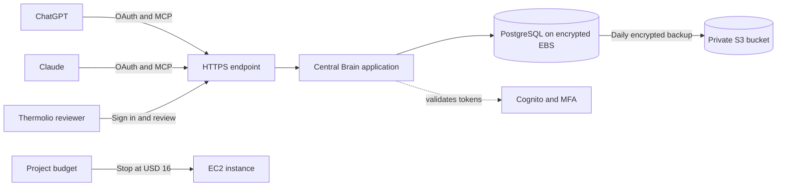

# Thermolio Central Brain: AWS pilot

This deployment was approved on September 10, 2026, with a CAD $40 monthly project budget. The AWS infrastructure, HTTPS application, Cognito configuration, and daily backups are deployed. The owner invitation and server authorization are complete. First sign-in, MFA enrollment, and authenticated assistant tool tests are still pending.

## Open Central Brain

The review website is [Thermolio Central Brain](https://16.54.184.1.sslip.io). Its temporary hostname is free and points to the project's static Elastic IP. Caddy obtains and renews the TLS certificate automatically. A Thermolio subdomain can replace it later, with corresponding OAuth configuration changes.

The website is publicly reachable so cloud assistants can connect, but memories and tools require an approved account. The database has no public port. The server is administered through AWS Systems Manager, with no SSH port open.

## Finish your first sign-in

1. Open the Cognito invitation that was sent to the approved owner address. Use its temporary password for the first sign-in.
2. Set a permanent password and enroll an authenticator app when prompted. Do not share your password or MFA code in this chat.
3. Sign in to Central Brain and confirm that you can open the review workspace. The account's immutable Cognito subject is already mapped to the pilot workspace with review permissions.
4. Confirm the separate AWS notification subscription email so spending and service alerts can be delivered.
5. Choose the intended Claude account. No Claude connector has been saved to an account yet.
6. Complete each assistant's OAuth connection and run the acceptance checks below.

## How the connection works

An assistant can retrieve approved memories and submit proposals. A proposal becomes reusable only after you approve it in Central Brain. Enable the connector in the assistant conversation where you want to use it. This does not silently capture every conversation or import existing ChatGPT or Claude histories.

## Connector settings

| Setting | Value |
| --- | --- |
| MCP address and OAuth resource | `https://16.54.184.1.sslip.io/mcp/` |
| Transport | Streamable HTTP |
| Authentication | OAuth authorization code with PKCE S256 |
| Client registration | Use the pre-registered client ID and client secret. |
| Assistant scopes | `central-brain/read central-brain/propose` |
| ChatGPT base scope | `openid` |
| ChatGPT token authentication | `client_secret_basic` |
| ChatGPT client ID | `m36n9li0m0okmav3f4iun6nqs` |
| Claude client ID | `5af37i8noofq889d50e2kvejq5` |
| ChatGPT callback from the prepared form | `https://chatgpt.com/connector/oauth/ixfeyzGASI9E` |
| Claude hosted callback | `https://claude.ai/api/mcp/auth_callback` |

Client secrets remain in Cognito and must be entered only into the intended assistant's OAuth configuration. They are not included in this guide. If ChatGPT generates a different callback when its form is reopened, update that client's callback before connecting.

ChatGPT developer mode is enabled, and its connector form is prepared. Both ChatGPT and Claude reached the live server and discovered its OAuth settings. The owner invitation was sent, the immutable Cognito subject was authorized, and the live service reloaded the new mapping. Neither first sign-in nor authenticated tool access has been validated yet.

Cognito signs and issues access tokens. A small metadata endpoint advertises its supported S256 method for MCP clients. The application still verifies the original Cognito issuer, signature, expiry, token type, allowed client, mapped user, and exact MCP resource audience. Assistant clients cannot obtain review or deletion powers through extra scopes.

## Acceptance checks after onboarding

1. Connect ChatGPT and ask it to propose: “For this integration test, the preferred report currency is CAD.” The proposal should appear in Needs review.
2. Search for it from Claude before approval. The pending proposal must not appear in approved search results.
3. Approve it in the Central Brain website, then search from both assistants. Both should retrieve it with its source.
4. Ask either assistant to approve or delete it. Those operations must not be available to the connector.
5. Delete the test memory through the review website. Confirm that subsequent assistant searches no longer return it.
6. Reconnect after an access token expires to verify refresh behavior, and confirm that invalid or unmapped accounts are rejected.

## Costs and controls

The following planning estimate uses 744 hours, CAD $1.50 per USD, and a conservative 15 percent tax allowance. These are planning assumptions, not a quoted exchange rate or a billing guarantee. Existing AWS workloads and existing ChatGPT/Claude subscriptions are outside this project's estimate.

| Item | Normal monthly USD estimate |
| --- | ---: |
| One `t4g.small` at USD $0.0184/hour | $13.69 |
| 28 GB of encrypted gp3 EBS at USD $0.088/GB | $2.46 |
| One public IPv4 address at USD $0.005/hour | $3.72 |
| Light backup, monitoring, and transfer allowance | $1.50 |
| Total before credits | $21.37 |

A full month at ordinary rates is approximately CAD $36.87 under those assumptions. AWS currently advertises up to 750 monthly `t4g.small` trial hours through December 31, 2026. If that credit applies, the estimate falls to approximately CAD $13.25. Actual credit application must be checked in billing. Do not assume a permanently free server. [AWS T4g trial](https://aws.amazon.com/ec2/instance-types/t4/).

The project has a USD $20 monthly budget filtered by the activated `Project=CentralBrain` tag. An automatic action is configured to stop only instance `i-02299bccafd17a809` at USD $16 of reported project cost. The lower threshold leaves room for delayed billing, currency conversion, taxes, and retained resources. The action is configured and in standby; its billing-triggered execution has not been forced during setup.

AWS Budgets is not a hard spending cap. Charges arrive late, some shared charges may not carry project tags, and EBS, S3, and the Elastic IP can continue accruing charges while the instance is stopped. The stop control can interrupt service before month end if the trial does not apply. The alert subscription was created, but email delivery remains pending until the recipient confirms the SNS subscription. This is the account's only action-enabled budget, within AWS's allowance of two free action-enabled budgets. [AWS Budgets pricing](https://aws.amazon.com/aws-cost-management/aws-budgets/pricing/).

The deployment uses standard CPU credits, Cognito Lite with authenticator MFA, standard encrypted Parameter Store, and a single server. It does not provision RDS, a load balancer, a NAT gateway, paid DNS, or an inference API.

## Operations and recovery

| Resource | Identifier |
| --- | --- |
| Region and zone | `ca-central-1`, `ca-central-1a` |
| CloudFormation stack | `central-brain-pilot` |
| EC2 instance | `i-02299bccafd17a809` |
| Database volume | `vol-01bcb97f5d36abbcd` |
| Backup bucket | `central-brain-pilot-backups-83ve7xpsxvxs` |
| Cognito pool | `ca-central-1_T8tjnzjRh` |
| Encrypted configuration | `/central-brain/pilot/environment` in SSM Parameter Store |
| Host application directory | `/opt/central-brain/deploy` |
| Persistent filesystem | `/srv/central-brain` |

Run the repository's `scripts/pilot_aws.py` wrapper to assume the project deployment role without storing temporary AWS credentials. Use the existing stack outputs rather than provisioning duplicates. `deploy/prepare-host.sh` matches the exact EBS volume serial, refuses ambiguous devices, mounts by filesystem UUID, and makes Docker depend on that mount.

Daily backups run at 06:00 UTC with up to ten minutes of jitter. The S3 lifecycle retains current backups for 30 days and old object versions for seven days. Session tokens are excluded. `deploy/verify-cloud-restore.sh` restores one named backup into a temporary database and removes only that test database afterward. The first cloud restore passed with workspace data, row security policies, and no sessions.

To pause compute, stop the project's instance through EC2. Do not delete its retained disk or backup bucket. Stopping does not eliminate all costs. A complete decommission requires a separate explicit decision about retaining or deleting data and releasing the Elastic IP.

This is a single-instance pilot with no high availability. Keep the data disk and backups when replacing the instance. Never format an existing data volume during recovery. No existing AWS application or database was modified during this deployment.

## Verification completed

Nine local PostgreSQL tests passed, including authorization, row isolation, memory review, concurrency, MCP tools, OAuth discovery, and strict token audiences. CloudFormation and Python lint checks passed. The live HTTPS certificate, health and readiness endpoints, unauthenticated API rejection, MCP authentication challenge, OAuth metadata, Cognito sign-in page, scheduled backup, and isolated cloud restore were verified. A full EC2 reboot also passed: the correct encrypted data filesystem mounted, Docker and backups restarted, the application remained nonroot with a read-only root filesystem, and HTTPS readiness recovered. The owner invitation, immutable subject authorization, live configuration reload, and alert subscription creation also passed. First sign-in, MFA enrollment, alert subscription confirmation, and authenticated assistant use remain acceptance gates.
